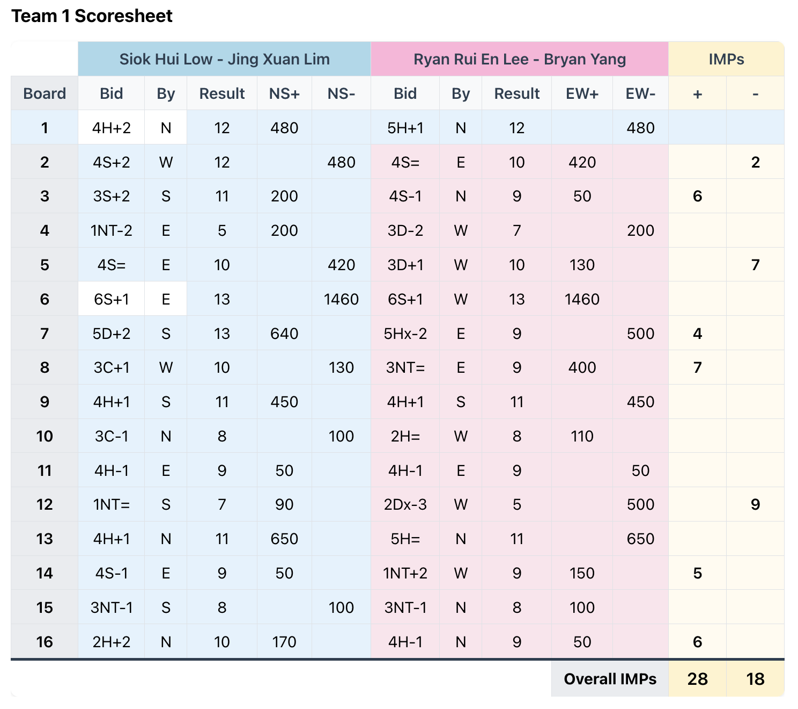

# Objective
Build a client-server web app for a in-house contract bridge tournament.

# Background and tournament format
We are a group of friends who are organizing a in-house contract bridge tournament amongst ourselves. There are a total of 12 participants split into 3 teams of 4. The format of the tournament is duplicate IMPs team match with VP scoring. There will be a total of 3 rounds. All 12 participants will be playing at the same time in each round in a triangle format so each team will play against both of the other teams in each round.

We would have teams A (consisting of pair A1 and pair A2), B (consisting of pair B1 and pair B2) and C (consisting of pair C1 and pair C2). There will be 3 playing tables, each with 6 boards. All 18 boards are unique. Each round is made up of two halves. Assuming we have A1 (NS) vs B1 (EW) at Table 1 (Boards 1-6), B2 (NS) vs C1 (EW) at Table 2 (Boards 7-12) and C2 (NS) vs A2 (EW) at Table 3 (Boards 13-18), after table has finished their 6 boards, the pairs sitting NS would stay while the pairs sitting EW would move to the next Table on the left and the boards would move in the opposite direction. So the second half of the round would be A1 (NS) vs C1 (EW) at Table 1 (Boards 13-18), B2 (NS) vs A2 (EW) at Table 2 (Boards 1-6) and C2 (NS) vs B1 (EW) at Table 3 (Boards 7-12). At the end the round each team would have completed a 6-board team match against each other team that we can calculate IMPs and VPs for. The same arrangement would go on for 3 rounds, possibly with different pairs sitting at NS each time for greater diversity, and VPs are tallied up for the final ranking.

# Key functionalities of web app

## Creating a new game
On the landing page of the web app, user should be able to create a new game and enter team information such as team name and pairings. There is no need for it to be generic, just cater for the exact tournament format described above. A new shareable url should be generated for a new game. All subsequent operations and views would be from the new url.

## Submitting results
During each round, users from each table should be able to submit the results of each board. It doesn't have to be only one user from each table that can submit results for the table but care should be taken that there are no duplicate results. User should be able to view and edit the results that have been submitted to make sure there are no typos. The results should consist of the following fields: board number, contract (e.g. 2S or 6Hx), declarer (N, S, E or W) and the result (e.g. =, +1, -1). The score can be computed via standard bridge scoring, with all boards being all non-vulnerable.

Take note that the results of each round should not be visible to other participants before the round ends (i.e. everyone has completed and submitted results for their 12 boards). So during the round, you can only see the results you have submitted (if any) and nothing else.

## Viewing results
After all the results for the round has come in, the system can compute the scores of each head to head matchup (i.e. Team A vs Team B, Team A vs Team C and Team B vs Team C) using standard IMP conversion, subsequently from IMP differential to VP using 6-board VP scoring.

For each matchup, there is a results summary with the IMPs and VPs as well as a detailed scoresheet that looks like 

There should also be a live ranking of the teams with their current VP score.

# Design choices
Since this web app is meant to only facilitate this particular in-house tournament rather than being for generic public use, we want the design to be as simple as possible with minimum external dependencies and straightforward user flow.

## External storage
The results have to be stored somewhere so other users can view them. Ideally this is done on the server filesystem without using a separate database solution.

## Authentication
There should be no need for users to create an account to use the web app. We can trust users will not behave maliciously and there will not be outsiders interfering with the game as they would need to know the game url. Ideally, users would not need to identify themselves when submitting results. A possible implication of this is that the results they submitted might need to be stored in local storage so they can keep track of what they submitted.
